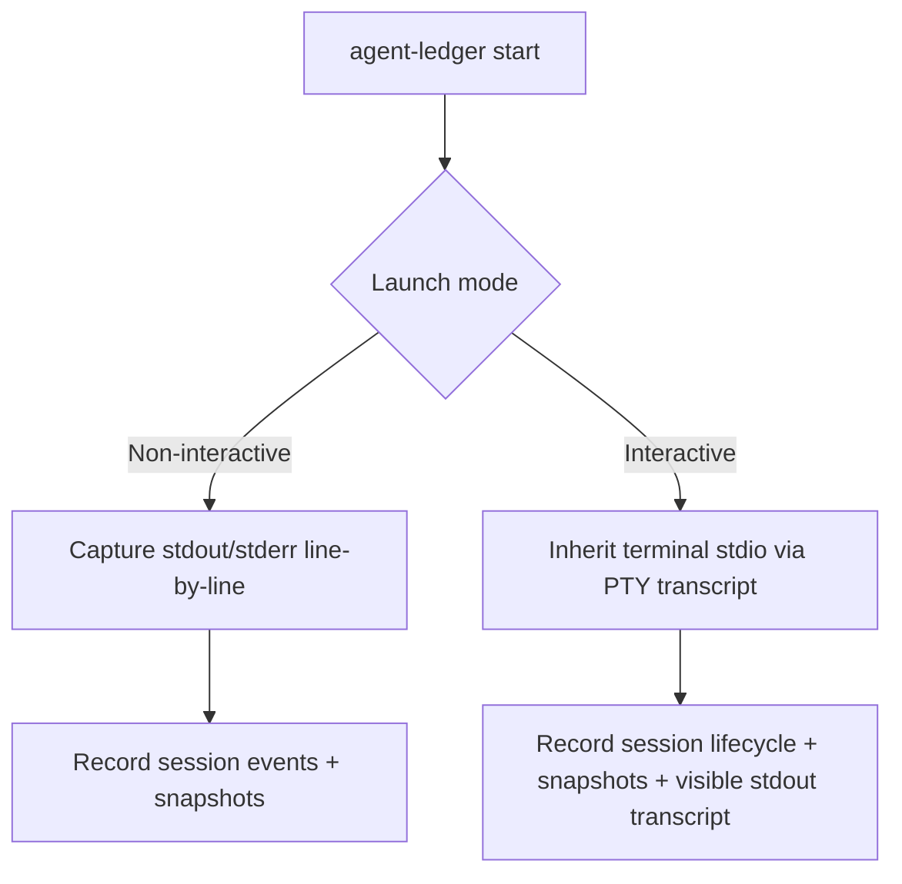
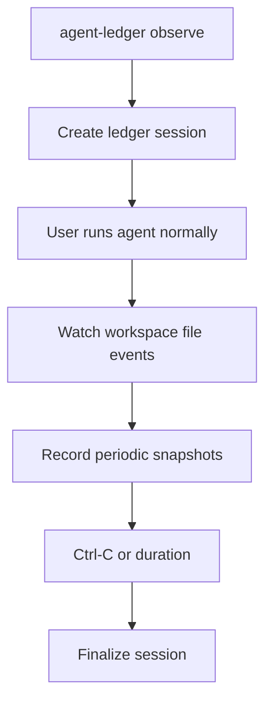

# agent-ledger

A tamper-evident coding challenge session runner that wraps agent CLIs (GitHub Copilot, OpenAI Codex, Claude Code, etc.) to track and verify challenge sessions with cryptographic evidence.

---

## Overview

`agent-ledger` is a Rust CLI tool designed for team coding challenges where everyone builds the same app and the winner is determined by quality and token efficiency.

It wraps a coding agent CLI session and produces a **signed, tamper-evident evidence bundle** containing:

- Every terminal event (stdin, stdout, stderr)  
- File change events  
- Workspace hash snapshots  
- Git diffs  
- Token reports (where available)  
- A final submission archive with an ed25519 signature

### What `agent-ledger` can prove

| Claim | Supported |
|-------|-----------|
| What happened **inside** the session | ⚠️ Partial for interactive sessions |
| What files changed during the session | ✅ |
| What commands ran inside the agent | ⚠️ Depends on launch mode |
| What the agent printed | ⚠️ Captured for non-interactive launches and best-effort interactive transcript tailing |
| What token reports were captured | ✅ |
| Whether the final workspace matches the recorded session hash | ✅ |
| That **no work occurred outside** the wrapper | ❌ (requires controlled environment) |

> **Integrity limit**: `agent-ledger` v0.1 operates at **Level 1 (Local Evidence)**. It cannot prove exclusivity unless run inside a controlled environment (Docker/devcontainer). Remote-hosted challenge environments (Level 2/3) are planned for future releases.
>
> **Capture limit**: interactive agents use a PTY transcript path where available. `agent-ledger` tails visible stdout for live evidence and usage reports, but stdin is not replayable and terminal control sequences may reduce transcript fidelity. Non-interactive agents capture stdout/stderr line-by-line.

---

## Installation

### From source

```bash
git clone https://github.com/SamMRoberts/agent-ledger
cd agent-ledger
cargo build --release
# Binary is at target/release/agent-ledger
```

### Requirements

- Rust 1.70+
- Git (for workspace snapshotting)
- One or more supported agent CLIs: `gh` (Copilot), `codex`, or `claude`

---

## Quick Start

```bash
# Check which agent CLIs are available
agent-ledger doctor

# Initialize a new challenge config in the current directory
agent-ledger init

# Start a session with Copilot CLI
agent-ledger start --agent copilot

# Start a session with Codex CLI  
agent-ledger start --agent codex

# Or observe a session while you use an agent normally elsewhere
agent-ledger observe --agent copilot

# During a session: take a manual snapshot
agent-ledger snapshot

# Check session status
agent-ledger status

# On macOS: launch the menubar status companion
cargo run -p agent-ledger-menubar -- --root .

# Create a signed submission bundle
agent-ledger submit

# Verify a submission bundle
agent-ledger verify .ledger/sessions/<session-id>/final/submission.tar.gz
```

---

## Commands

### `agent-ledger doctor`

Checks whether required tools are installed.

```
$ agent-ledger doctor
git: ok
copilot: ok
  version: gh version 2.x.x
  path: /usr/bin/gh
codex: missing
  note: Codex detection is based on the codex binary being available in PATH
claude: missing
  note: Claude detection is based on the claude binary being available in PATH
```

### `agent-ledger init`

Creates the challenge configuration file (`ledger.yaml`) and the `.ledger/` directory.

```
$ agent-ledger init
Initialized agent-ledger in .ledger
```

**Generated `ledger.yaml`:**

```yaml
id: todo-app-2026-06
name: Todo App Challenge
baseline_repo: https://github.com/example/todo-challenge
allowed_agents:
  - copilot
  - codex
time_limit_minutes: 120
workspace:
  mode: local
network:
  mode: unrestricted
commands:
  install: npm install
  test: npm test
  build: npm run build
scoring:
  public_tests_weight: 40
  hidden_tests_weight: 40
  token_efficiency_weight: 20
```

Edit this file to configure your challenge.

### `agent-ledger start --agent <agent>`

Starts a new wrapped session for the specified agent.

```
$ agent-ledger start --agent copilot
```

This command:
1. Creates a unique session ID
2. Initializes the SQLite session database
3. Generates an ed25519 signing keypair
4. Captures the baseline workspace hash and git commit
5. Writes a `session_started` event to the event log
6. Launches the agent CLI and records its capture mode in the session manifest
7. Records stdout/stderr line events for non-interactive launches; interactive launches inherit the terminal through a PTY transcript path and record best-effort visible stdout lines
8. On exit: captures final workspace hash, writes `session_finished` event

**Capture modes**

- Non-interactive agents: stdout/stderr are captured line-by-line in the event log.
- Interactive agents: stdio is inherited through a PTY transcript path, so session lifecycle, snapshots, and visible stdout transcript lines are recorded when capture is available. Copilot AI Credit usage is derived from visible `/usage`, statusline, or exit-summary output.



**Session directory layout:**

```
.ledger/
  sessions/
    <session-id>/
      session.db
      events.jsonl
      session_manifest.json
      session.key
      workspace.snapshots/
      diffs/
      test-results/
      final/
```

### `agent-ledger observe --agent <agent>`

Starts a new observer-mode session without launching the agent process.

```
$ agent-ledger observe --agent copilot
```

Use this mode when you want to run an agent normally in another surface, such as VS Code Copilot Chat, Copilot CLI, Codex, or Claude, while `agent-ledger` records workspace evidence in the background.

This command:
1. Creates the same session directory layout as `start`
2. Captures the baseline workspace hash and git diff
3. Watches the workspace for file create, modify, delete, and rename events
4. Ignores internal/generated paths such as `.ledger`, `.git`, `target`, `node_modules`, `dist`, and `build`
5. Records periodic workspace hash and git diff snapshots
6. On Ctrl-C or `--duration-seconds`: captures a final snapshot and writes `session_finished`

Flags:

- `--snapshot-interval-seconds <n>`: periodic snapshot interval in seconds (defaults to `300`)
- `--duration-seconds <n>`: finish automatically after the duration instead of waiting only for Ctrl-C

**Capture mode**

Observer mode records lifecycle, workspace file events, workspace hashes, and git diffs. It does not launch the agent and does not capture full terminal stdin/stdout. Token reports and richer agent activity require visible wrapper output or future explicit collectors/ingestion.



### `agent-ledger snapshot`

Manually records a workspace snapshot at any point during a session.

Records:
- Current workspace hash
- Git diff (if in a git repository)

### `agent-ledger status`

Shows the current session state.

```
$ agent-ledger status
Session:   session-01J...
Agent:     copilot
Started:   2026-06-12T15:32:10Z
Elapsed:   47m 23s
Events:    284
Workspace: abc123...
Chain:     valid
```

For Copilot sessions, `status` also reports AI Credits when Copilot usage output has been observed during the session:

```
aic_used: 1.25
aic_remaining: 48.75
aic_limit: 50
```

Run `/usage` in Copilot, or enable Copilot usage/statusline output, to make AIC values visible to the ledger while the session is still active.

### `agent-ledger-menubar` (macOS only)

Launches a macOS menubar companion that polls the current workspace and shows the active or most recent session state in the menu bar.

```bash
$ cargo run -p agent-ledger-menubar -- --root .
```

Flags:

- `--root <path>`: workspace root to monitor (defaults to current directory)
- `--refresh-seconds <n>`: polling interval in seconds (defaults to `2`)

The menubar item is read-only in v0.1. It reuses the same session manifest and event log data as `agent-ledger status`, updates its title/icon as sessions change, and provides menu actions to refresh or open the current session folder.

### `agent-ledger submit`

Creates a signed submission bundle.

```
$ agent-ledger submit
Created submission bundle at .ledger/sessions/<session-id>/final/submission.tar.gz
```

**Bundle contents (`submission.tar.gz`):**

```
session_manifest.json   # Session metadata + public key
events.jsonl            # Append-only event log with hash chain
workspace_hash.json     # Final workspace hash
final.diff              # Git diff from baseline to submission
signature.ed25519       # ed25519 signature over session data
```

### `agent-ledger verify <bundle-path>`

Verifies a submission bundle.

```
$ agent-ledger verify ./submission.tar.gz
Bundle verification passed for session-01J...
```

Checks performed:
1. Required files exist in the bundle
2. Event log hash chain is valid (no modifications, deletions, or reordering)
3. ed25519 signature is valid
4. Final workspace hash matches the manifest

---

## Event Log Design

All session events are written to `events.jsonl` as an append-only JSONL file with a cryptographic hash chain.

**Event format:**

```json
{
  "seq": 1,
  "timestamp": "2026-06-12T15:32:10.123Z",
  "session_id": "session-01J...",
  "event_type": "agent_stdout",
  "payload": { "line": "Creating todo.js..." },
  "payload_hash": "blake3:<hex>",
  "prev_hash": "<previous-event-hash>",
  "event_hash": "<current-event-hash>"
}
```

**Hash chain formula:**

```
event_hash = blake3(seq + "|" + timestamp + "|" + session_id + "|" + event_type + "|" + payload_hash + "|" + prev_hash)
```

The first event uses `prev_hash = "genesis"`. Any modification, deletion, or reordering of events will break the chain and be detected by `verify`.

**Supported event types:**

| Event Type | Description |
|------------|-------------|
| `session_started` | Session initialization |
| `session_finished` | Session completion |
| `agent_started` | Agent process launch |
| `agent_stopped` | Agent process exit |
| `agent_stdin` | Input sent to agent |
| `agent_stdout` | Output from agent |
| `agent_stderr` | Stderr from agent |
| `file_created` | File creation event |
| `file_modified` | File modification event |
| `file_deleted` | File deletion event |
| `file_renamed` | File rename event |
| `git_diff_snapshot` | Git diff at a point in time |
| `workspace_hash_snapshot` | Full workspace hash snapshot |
| `token_report` | Token usage from agent |
| `test_run_started` | Test suite start |
| `test_run_finished` | Test suite completion |
| `submission_created` | Bundle creation |
| `verification_result` | Verification outcome |
| `warning` | Non-fatal warning |
| `error` | Error event |

---

## Supported Agents

| Agent | Detection | Launch Command | Token Tracking |
|-------|-----------|----------------|----------------|
| `copilot` | `gh --version` + copilot extension | `gh copilot suggest` | Planned |
| `codex` | `codex` in PATH | `codex` | Planned |
| `claude` | `claude` in PATH | `claude` | Planned |

---

## Scoring Model

The scoring system tracks:

- `reported_tokens_total` — from agent CLI if available
- `estimated_tokens_total` — approximated from captured I/O
- `tool_calls_total` — number of tool invocations
- `elapsed_active_time_seconds` — wall clock session time
- `public_tests_passed` / `public_tests_failed`

**Score formula (placeholder, subject to change):**

```
quality_score  = tests_passed_ratio × public_tests_weight + code_quality_score
efficiency_score = quality_score / max(1, normalized_token_count)

final_score = quality_score × 0.75 + efficiency_score × 0.25 - rule_violation_penalties
```

---

## Integrity Levels

### Level 1: Local Evidence (current)

- Local wrapper  
- Signed event logs with hash chain  
- Git snapshots  
- Token estimates  
- Final submission bundle  

### Level 2: Controlled Local Environment (planned)

- Docker/devcontainer runner  
- Restricted network access  
- Approved tools only  
- Workspace only writable inside controlled container  

### Level 3: Hosted Challenge Runner (planned)

- Remote ephemeral environments  
- Server-side event capture  
- Server-side hidden tests  
- Server-side leaderboard  

---

## Project Structure

```
agent-ledger/
  Cargo.toml                      # Workspace root
  crates/
    agent-ledger-cli/             # CLI binary (clap-based)
      src/
        main.rs
        commands/
          doctor.rs
          init.rs
          start.rs
          snapshot.rs
          status.rs
          submit.rs
          verify.rs
    agent-ledger-core/            # Core data models and verification logic
      src/
        session.rs                # Session model
        status.rs                 # Shared session artifact + status summary helpers
        manifest.rs               # Challenge manifest (YAML)
        event.rs                  # Event log writer
        hash_chain.rs             # Hash chain verification
        signing.rs                # ed25519 session signing
        workspace.rs              # Workspace hash computation
        storage.rs                # SQLite session storage
        scoring.rs                # Scoring model
    agent-ledger-agents/          # Agent adapter implementations
      src/
        adapter.rs                # AgentAdapter trait
        copilot.rs                # GitHub Copilot adapter
        codex.rs                  # OpenAI Codex adapter
        claude.rs                 # Anthropic Claude adapter
    agent-ledger-runner/          # Process/PTY/file watching
      src/
        pty.rs                    # PTY session (pipe-based for MVP)
        process.rs                # Process runner with I/O capture
        file_watcher.rs           # Filesystem watcher (notify)
        git.rs                    # Git shell-out helpers
    agent-ledger-menubar/         # macOS menubar companion binary
      src/
        main.rs
        macos.rs
        presentation.rs
```

---

## Development

```bash
# Build
cargo build

# Run tests
cargo test

# Run a specific test
cargo test hash_chain

# Check for warnings
cargo clippy
```

---

## Known Limitations

- PTY support is pipe-based in v0.1; full pseudo-terminal wrapping (with terminal resizing) requires `portable-pty` and is planned.
- Token tracking is a placeholder estimator; real tokenization per agent is a future enhancement.
- File watching integration during `start` is architecture-ready but not yet wired into the event log in v0.1.
- The menubar companion is macOS-only in v0.1 and uses polling rather than live filesystem watch updates.
- Level 1 integrity cannot prove that no work occurred outside the wrapper; use a controlled environment for stronger guarantees.
- Submission bundles do not yet include a full workspace archive (planned: `.tar.zst` of workspace files).

---

## License

MIT